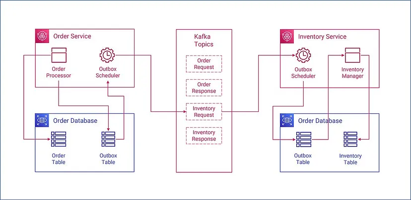

# POC of Outbox Event Pattern

This project showcases the implementation of the Outbox Pattern in Spring Boot, demonstrating how to ensure reliable event publishing by storing event data in an Outbox table within the same database transaction as the primary data modification operations.

## Outbox Event Pattern

The Outbox event pattern is a design pattern used in distributed systems to ensure reliable event publishing while maintaining transactional integrity.

In traditional event-driven architectures, events are often published to a message broker (e.g., Kafka, RabbitMQ) after a successful database transaction. However, this approach can lead to inconsistencies if the message fails to be published or the system crashes before the event is sent.

The Outbox pattern solves this problem by decoupling the event publishing process from the database transaction. Instead of directly publishing events, the application writes event data to an Outbox table within the same database transaction as the primary data modification. This ensures that both the primary data and associated events are either committed or rolled back atomically.

Separately, a background process (e.g., a scheduler, a dedicated service) reads pending events from the Outbox table and publishes them to the message broker. This asynchronous approach guarantees that events are reliably delivered even in the event of failures or system crashes.

By using the Outbox event pattern, developers can achieve consistency and reliability in event-driven systems, enabling seamless integration between different components and ensuring data integrity across distributed environments.

## Example System Design

